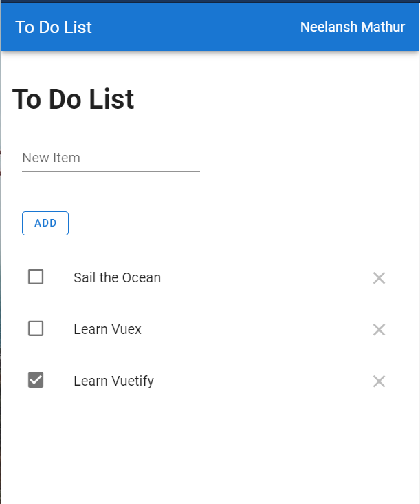

# ToDo PWA
A Progresive Web App made in VueJS.  
__Design Framework__: Vuetify  
__State Management__: Vuex

The app can be installed right away from your browser (ex: Chrome) on your desktop or mobile!  
Visit it at: https://hypertodo.ml or https://todolist-m15.web.app



## Project setup
```
npm install
```

### Compiles and hot-reloads for development
```
npm run serve
```

### Compiles and minifies for production
```
npm run build
```

### Lints and fixes files
```
npm run lint
```

### Customize configuration
See [Configuration Reference](https://cli.vuejs.org/config/).
